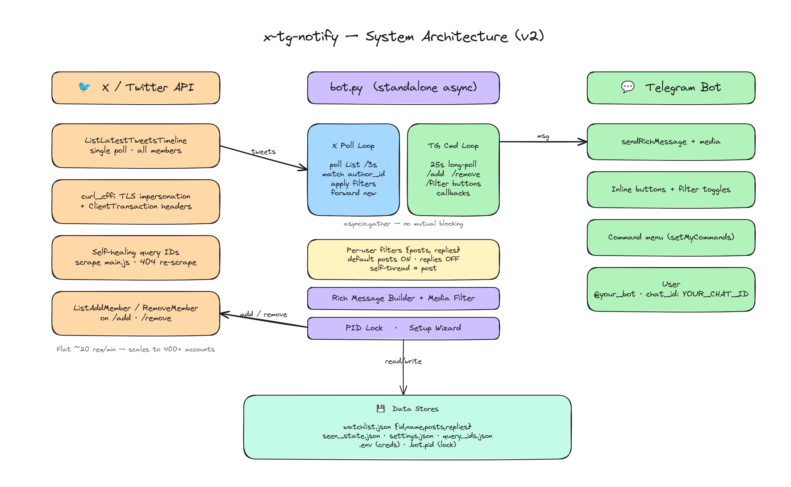

<div align="center">

# x-tg-notify

**Real-time X (Twitter) → Telegram notification forwarder**

[](https://python.org)
[](LICENSE)

Monitor X accounts and receive instant Telegram alerts when they post — with photos, videos, clickable links, and inline action buttons. Built on a single X List poll that scales flat to 400+ accounts.

[Features](#features) · [Quick Start](#quick-start) · [Commands](#commands) · [Configuration](#configuration) · [Architecture](#architecture)

</div>

---

## Features

- **Scales to 400+ accounts** — a single `ListLatestTweetsTimeline` poll returns new tweets across every watched account at a flat ~20 requests/min, instead of polling each user separately
- **Two decoupled async loops** — X polling and Telegram commands run under `asyncio.gather`, so neither blocks the other (no command lag, no missed tweets)
- **Per-user filters** — toggle **posts** and **replies** independently per account (`/filter`, or inline buttons on `/add`). Default: posts ON, replies OFF. Self-threads count as posts
- **Rich messages** — structured formatting with headings, dividers, and embedded media
- **Photo + Video + GIF** — media types individually toggleable via `/settings`
- **Inline buttons** — "Go to Post" links to the tweet; "Stop Notify" removes the account; filter toggles
- **Command menu** — native Telegram `/` command menu via `setMyCommands`
- **Self-healing query IDs** — GraphQL query IDs are scraped from `main.js`, cached, and auto-refreshed on a 404
- **No old-post flood** — `/add` and startup seed a snowflake baseline so only genuinely new tweets are forwarded
- **Deduplication** — tweet ID tracking persists across restarts; never forwards the same tweet twice
- **Anti-detection** — Chrome TLS fingerprint impersonation (`curl_cffi`) + per-request ClientTransaction headers
- **Setup wizard** — interactive first-run: credentials, venv, connection validation
- **Single instance lock** — PID file prevents concurrent bot instances

---

## Quick Start

### 1. Clone and run

```bash
git clone https://github.com/oxkage/x-tg-notify.git
cd x-tg-notify
python3 bot.py
```

On first run, the **setup wizard** launches automatically:

1. Checks Python 3.10+
2. Creates virtual environment and installs dependencies
3. Walks you through each credential (step-by-step)
4. Validates Telegram connection (sends test message)
5. Verifies X credential format
6. Saves everything to `.env`

### 2. Create an X List

The bot polls a single private X List for efficiency. Create one on X (it can be private), then add its ID to `.env`:

```bash
X_LIST_ID=1234567890123456789
```

> [!TIP]
> The List ID is the number in the List URL: `x.com/i/lists/<X_LIST_ID>`. The bot auto-adds watched accounts to this List on `/add` and migrates your existing watchlist into it on startup.

### 3. Add accounts

Send `/add @username` to your Telegram bot — it follows them, adds them to the List, and shows post/reply filter toggles.

### 4. Done

New posts arrive in your Telegram chat with photos, timestamps, and inline buttons.

> [!TIP]
> Re-run the setup wizard anytime with `python3 bot.py --setup`

---

## Commands

| Command | Description |
|---------|-------------|
| `/add @username` | Follow user + add to List + show filter toggles |
| `/remove @username` | Unfollow + remove from List |
| `/filter @username` | Toggle posts / replies for a user |
| `/list` | Show all watched users with their filter states |
| `/status` | Bot status + stats |
| `/settings` | Toggle media types (photo/video/gif) |
| `/help` | Show help message |

**Example — adding an account:**

```
You:    /add elonmusk
Bot:    ⏳ Resolving @elonmusk...
Bot:    ✅ Added Elon Musk
        👤 @elonmusk  ·  List ✅
        📝 Posts: ON     💬 Replies: OFF
        [📝 Posts]  [💬 Replies]  [🔕 Stop]
```

**Example — forwarded post:**

```
Bot:    ## 🔔 New Post

        **Elon Musk** ([@elonmusk](https://x.com/elonmusk))

        The thing about gravity is...

        📸 [embedded photo]

        ---
        🕐 Mar 27, 2026 · 14:30 UTC

        [🔗 Go to Post]  [🔕 Stop Notify]
```

---

## Getting Credentials

The setup wizard handles this interactively. For reference:

<details>
<summary><b>X Auth Token & CT0</b></summary>

1. Open [x.com](https://x.com) in your browser and log in
2. Open DevTools (F12) → Application → Cookies → `x.com`
3. Copy `auth_token` (40-char hex)
4. Copy `ct0` (long hex string)

> [!WARNING]
> These are session cookies — they expire when you log out of X. If the bot stops working, re-copy fresh cookies.
</details>

<details>
<summary><b>Telegram Bot Token</b></summary>

1. Open [@BotFather](https://t.me/BotFather) on Telegram
2. Send `/newbot` and follow the instructions
3. Copy the token (format: `123456:ABC-DEF...`)
</details>

<details>
<summary><b>Telegram Chat ID</b></summary>

1. Send any message to your bot
2. Visit `https://api.telegram.org/bot<YOUR_TOKEN>/getUpdates`
3. Find `"chat":{"id":XXXXX}` — that number is your Chat ID
</details>

<details>
<summary><b>X List ID</b></summary>

1. Create a List on X (private is fine)
2. Open it — the URL is `x.com/i/lists/<LIST_ID>`
3. Copy the numeric `LIST_ID` into `.env` as `X_LIST_ID`
</details>

---

## Configuration

### Per-user filters

Each watched account carries its own `{posts, replies}` flags:

| Flag | Default | Forwards |
|------|---------|----------|
| `posts` | ON | Original tweets + self-threads + retweets |
| `replies` | OFF | Replies to **other** accounts |

Toggle them with `/filter @user` or the inline buttons shown on `/add`.

### Media settings

Toggle individual media types via `/settings`:

| Setting | Default | Description |
|---------|---------|-------------|
| `photo_enabled` | ON | Send tweet photos |
| `video_enabled` | OFF | Send tweet videos |
| `gif_enabled` | ON | Send tweet GIFs |

Posts are always forwarded — media toggles only control attachments.

### Polling intervals

```python
LIST_POLL_INTERVAL = 3   # seconds — primary List timeline poll
```

The List poll is flat-cost: one request returns new tweets across **all** members regardless of how many accounts you watch, so 3s polling stays well within X's rate limits even at 400+ accounts.

---

## Architecture



1. **X Poll Loop** polls `ListLatestTweetsTimeline` every 3s — one request returns the newest tweets across every List member, time-sorted
2. Each tweet is matched to a watched account by `author_id`, then its per-user `{posts, replies}` filter is applied
3. New tweets (snowflake ID greater than last-seen) are forwarded to Telegram with rich formatting, embedded media, and inline buttons
4. **TG Command Loop** runs independently (`asyncio.gather`) on a long-poll, handling `/add`, `/remove`, `/filter`, callbacks, and List membership changes
5. GraphQL query IDs self-heal: scraped from `main.js`, cached in `query_ids.json`, re-scraped automatically on a 404

---

## File Structure

```
x-tg-notify/
├── bot.py              # Setup wizard + bot runtime (two async loops)
├── debug.py            # Debug CLI for testing
├── requirements.txt    # Python dependencies
├── .env.example        # Credential template
├── .env                # Your credentials (git-ignored)
├── watchlist.json      # Watched users + filters (git-ignored)
├── seen_state.json     # Dedup state (git-ignored)
├── settings.json       # Media toggles (git-ignored)
├── query_ids.json      # GraphQL query-ID cache (git-ignored)
├── venv/               # Virtual environment (auto-created)
└── .bot.pid            # Single instance lock (auto-created)
```

---

## Troubleshooting

**409 Conflict** — Another bot instance is running. The PID lock should prevent this, but if it happens:

```bash
pkill -f "python3 bot.py"
rm .bot.pid
python3 bot.py
```

**Unauthorized / auth failed** — Your `auth_token` expired. Re-copy fresh cookies from your browser.

**Not forwarding new posts** — Check `/list` to verify the user is watched and the filter (posts/replies) is enabled. Confirm `X_LIST_ID` is set and the account is in the List.

**404 on List timeline** — A GraphQL query ID went stale; the bot re-scrapes automatically. If it persists, restart to force a fresh scrape.

**Forwards old tweets on add** — Shouldn't happen (`/add` seeds a baseline). If it does, the account had no recent tweets to seed from; it self-corrects after the first new post.

---

## Credits

- [curl_cffi](https://github.com/yifeikong/curl_cffi) — TLS fingerprint impersonation
- [XClientTransaction](https://github.com/iSarabjitDhiman/XClientTransaction) — X anti-detection headers
